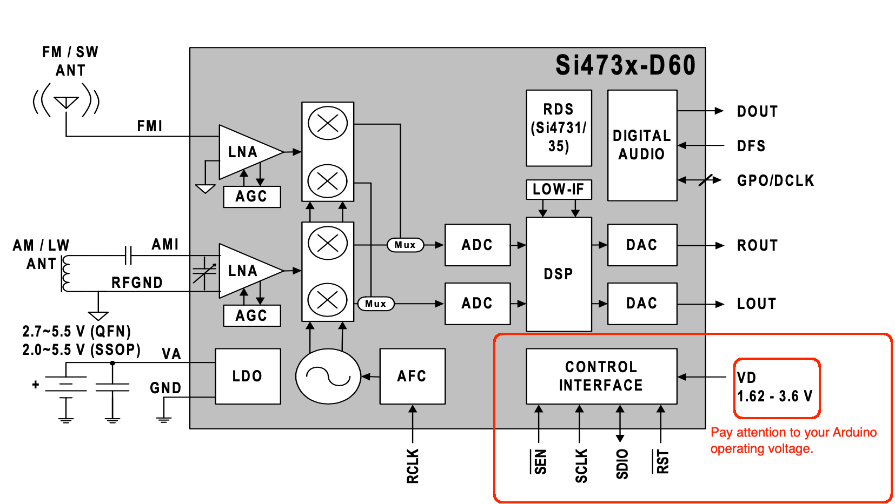
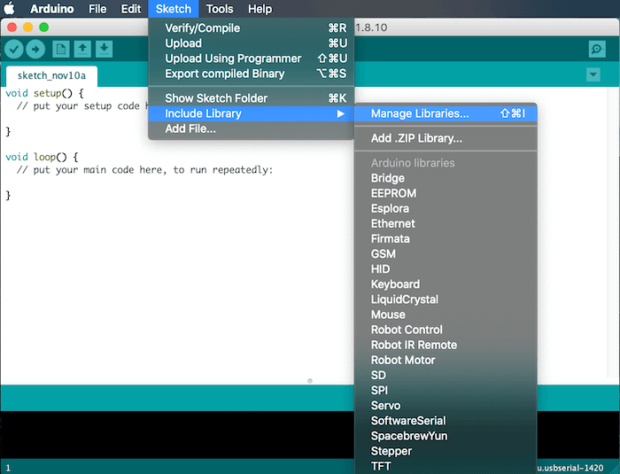
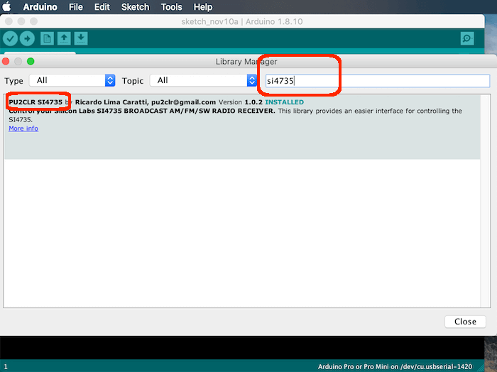
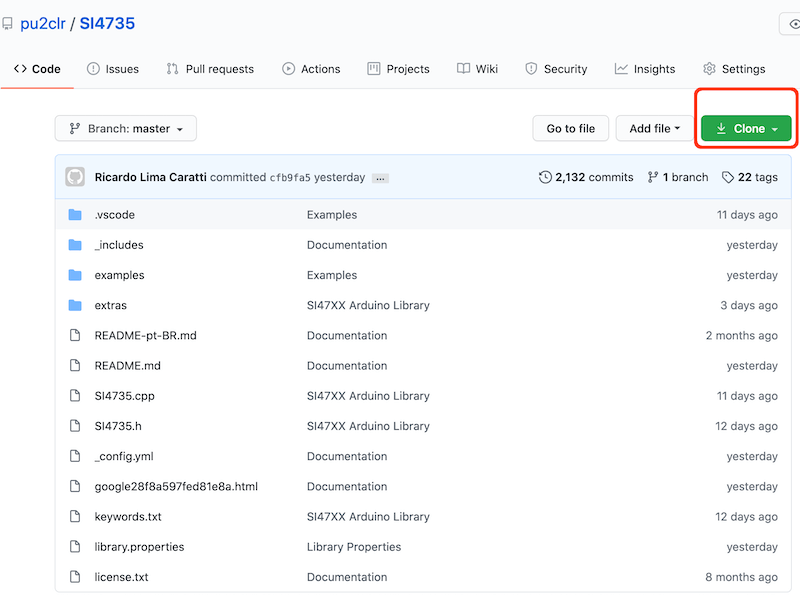
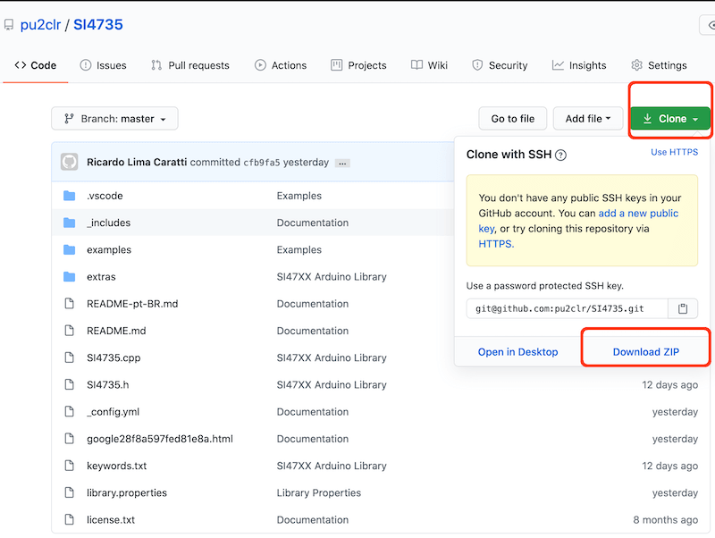
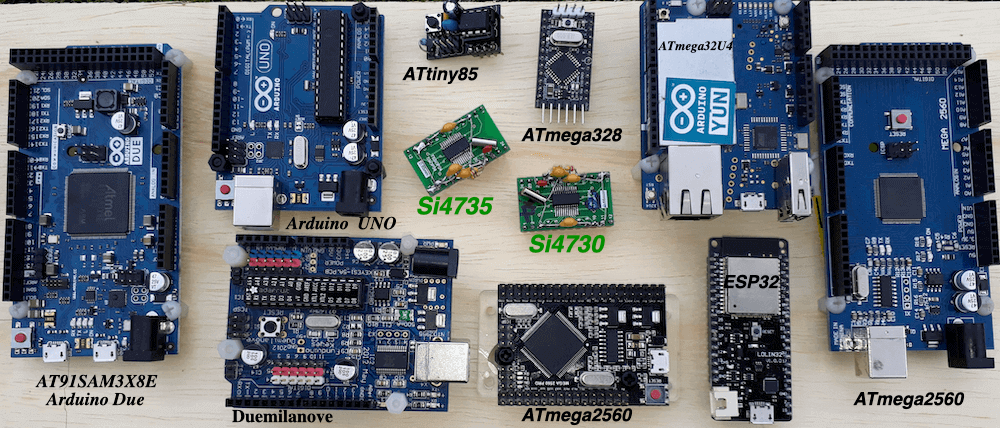
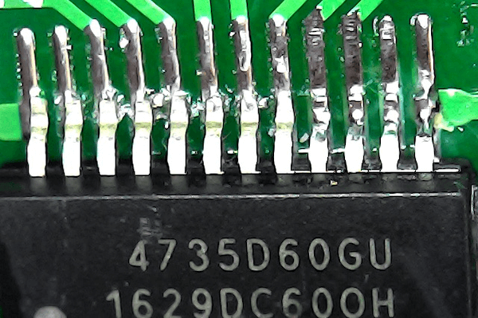

<meta name="google-site-verification" content="_wADvyP4vuP_aw0YTmu90mdAhz70vNwTF_pdAMMb0HY" />

# Si4735 Library for Arduino

This is an Arduino library for the SI47XX, BROADCAST AM/FM/SW RADIO RECEIVER IC family from Silicon Labs.  This library is intended to provide an easier interface for controlling the SI47XX by using Arduino platform. __The communication used by this library is I²C__. 

This library was built based on [“__Si47XX PROGRAMMING GUIDE; AN332__ ”](https://www.silabs.com/documents/public/application-notes/AN332.pdf). It also can be used on __all members of the SI473X family__ respecting, of course, the features available for each IC version. These functionalities can be seen in the comparison matrix shown in table 1 (__Product Family Function__); pages 2 and 3 of the programming guide.

This library can be freely distributed using the MIT Free Software model. [Copyright (c) 2019 Ricardo Lima Caratti](https://pu2clr.github.io/SI4735/#mit-licence)  

Contact: pu2clr@gmail.com

There is a facebook group called [__Si47XX for Radio Experimenters__](https://www.facebook.com/groups/532613604253401/) where the purpose is exchanging experiences with projects based on Silicon Labs  SI47XX IC family. You will be welcome to the group [Si47XX for Radio Experimenters](https://www.facebook.com/groups/532613604253401/).

__Attention__: 
* __Documentation  under construction__. 
* __The SI473 (SI473X) is a 3.3V part. If you are not using a 3.3V version of Arduino, you have to use a kind of 5V to 3.3V converter__.
* __This library has been successfully tested on Arduino Pro Mini 3.3V; Arduino UNO (using voltage converter); Arduino YÚN (using voltage converter); ESP32 (LOLIN32 WEMOS); Mega 2560 (using voltage converter); Genuino Micro/Atmega32u4 (using voltage converter) and Arduino DUE.__    

## Summary

1. [License Copyright](https://pu2clr.github.io/SI4735/#mit-licence)
2. [Thanks](https://pu2clr.github.io/SI4735/#thanks)
3. [Your support is important](https://pu2clr.github.io/SI4735/#your-support-is-important)
4. [About the SI4735](https://pu2clr.github.io/SI4735/#about-the-si4735)
5. [Terminology](https://pu2clr.github.io/SI4735/#si4735-terminology)
6. [Labrary Features](https://pu2clr.github.io/SI4735/#si4735-arduino-library-features)
7. [Library Installation](https://pu2clr.github.io/SI4735/#library-installation)
8. [API Documentation](https://pu2clr.github.io/SI4735/#api-documentation)
   * [About Class, Methods(functions) and custom data type structures](https://pu2clr.github.io/SI4735/#defined-data-types-and-structures)
   * [RDS support](https://pu2clr.github.io/SI4735/#rds)
   * [SSB support](https://pu2clr.github.io/SI4735/#si4735-patch-support-for-single-side-band)
9.  [Hardware Requirements and Setup](https://pu2clr.github.io/SI4735/#hardware-requirements-and-setup)
   * [Schematic](https://pu2clr.github.io/SI4735/#schematic)
   * [Component Parts](https://pu2clr.github.io/SI4735/#parts)
   * [Tips to build](https://pu2clr.github.io/SI4735/#tips-to-build)
   * [Boards where this library has been successfully tested](https://pu2clr.github.io/SI4735/#boards-where-this-library-has-been-successfully-tested)
   * [Photos (Tools and Accessories)](https://pu2clr.github.io/SI4735/#photos-tools-and-accessories)
11. [References](https://pu2clr.github.io/SI4735/#references)
12. [Examples](https://pu2clr.github.io/SI4735//tree/master/examples)
13. [Videos](https://pu2clr.github.io/SI4735/#videos) 
    * [Project examples made by the author](https://pu2clr.github.io/SI4735/#project-examples-made-by-the-author)
    * [Third-party projects using this library](https://pu2clr.github.io/SI4735/#third-party-projects-using-this-library)

## MIT License 

Copyright (c) 2019 Ricardo Lima Caratti

Permission is hereby granted, free of charge, to any person obtaining a copy of this software and associated documentation files (the "Software"), to deal in the Software without restriction, including without limitation the rights to use, copy, modify, merge, publish, distribute, sublicense, and/or sell copies of the Software, and to permit persons to whom the Software is furnished to do so, subject to the following conditions:

The above copyright notice and this permission notice shall be included in all copies or substantial portions of the Software.

THE SOFTWARE IS PROVIDED "AS IS", WITHOUT WARRANTY OF ANY KIND, EXPRESS OR IMPLIED, INCLUDING BUT NOT LIMITED TO THE ARRANTIES OF MERCHANTABILITY, FITNESS FOR A PARTICULAR PURPOSE AND NONINFRINGEMENT. IN NO EVENT SHALL THE AUTHORS OR COPYRIGHT HOLDERS BE LIABLE FOR ANY CLAIM, DAMAGES OR OTHER LIABILITY, WHETHER IN AN ACTION OF CONTRACT, TORT OR OTHERWISE, ARISING FROM, OUT OF OR IN CONNECTION WITH THE SOFTWARE OR THE USE OR OTHER DEALINGS IN THE SOFTWARE.

 
 

## Thanks

* I would like to thank Mr Francisco Scaramella  for the suggestions and contributions provided in the electronics field as well as for the testing of the functions implemented in this library;
* I would like to thank [Mr Vadim Afonkin](https://youtu.be/fgjPGnTAVgM) for making available the SSBRX patches for SI4735-D60 on his [Dropbox repository](https://www.dropbox.com/sh/xzofrl8rfaaqh59/AAA5au2_CVdi50NBtt0IivyIa?dl=0);
* David Kellmer (USA) for suggesting corrections on the documentation and sketches; 
* WH2Q, Morikaku Gotoh, for his suggestion about Automatic Volume Control on AM mode; 
* All members of the Facebook groups ["Si47XX for radio experimenters"](https://www.facebook.com/groups/532613604253401/) and ["Si47XX para radioescutas"](https://www.facebook.com/groups/1121785218031286/) for the  suggestions and corrections during the development of this project.

 
 

## Your support is important.

If you would like to support this library development, consider joining this project via Github. Alternatively, make suggestions on features you would like available in this library. Thank you!

 
 

## About the SI4735  

The Si4735 is DSP radio receiver IC from Silcon Labs. It has great performance on AM (LW/MW/SW) and local FM station. The SI4735 can be programmed by using commands and responses. You can contron it via a microcontroller like Arduino. To make the SI4735 perform an action, the microccontroller have to send a set of bytes (command and arguments) that the device interpret it and executes the given command.

 

## Radios based on Si47XX Family

The table below shows some radios based on SI47XX  

| Manufacturer | Model | CI |More information |
| ------------ | ----- | ---- |----------- | 
| Tecsun | PL310ET | Si4734 |[About](https://www.tecsunradios.com.au/store/product/tecsun-pl310et-multi-band-radio/)|
| Tecsun | PL-365 | Si4735 |[Review](https://swling.com/blog/2017/02/charlie-reviews-the-tecsun-pl-365/)|
| Tecsun | PL-360 | Si4734 |[Review](https://www.edn.com/review-tecsun-pl-360-emi-receiver/) |
| Tecsun | PL380 |  Si4734 |[Reviews](https://www.eham.net/reviews/view-product?id=10240) |
| Tecsun |  PL880 | Si4735 | [Reviews](https://www.eham.net/reviews/view-product?id=11457) |
| Degen | DE1103 DSP | Si4735 | [Review](https://swling.com/blog/2015/11/the-new-degen-de1103-dsp-first-impressions-review/)|
| Degen | DE1123/Kaito KA1123 | Si4734 |[Review](https://frrl.wordpress.com/2009/07/11/review-of-the-degen-de1123-dsp-amfmsw-pocket-radio-with-1gb-mp3-player-recorder/)|
| Degen | DE1125/Kaito KA801 | Si4734 | [Reviews](https://www.eham.net/reviews/view-product?id=9584)|
| Degen | DE1126 | Si4734 | [Review](https://sites.google.com/site/zliangas/de1126-review)|
| Degen | DE1127 (discontinued) | Si4734 | [Review](https://herculodge.typepad.com/herculodge/2012/01/dave-zantow-provides-firmware-updates-for-degen-de1127-and-de1126-models.html) |
| Sangean | ATS-909X |  Si4735 | [Review](https://swling.com/blog/tag/sangean-ats-909x-review/) |
| XHDATA | D808 | Si4735 |[Review](https://swling.com/blog/2018/04/a-detailed-review-of-the-xhdata-d-808-and-comparison-with-the-tecsun-pl-660/)|
| RADIWOW | R-108 |  | [Review](https://www.hagensieker.com/wordpress/2019/05/08/radiwow-r-108-short-wave-radio-review/)|
| C Crane |  CC Skywave |  |[Review](https://swling.com/blog/2014/12/review-of-the-c-crane-cc-skywave-portable-radio/) |

 
 

### Functional Block Diagram

The image below shows the SI473X-D60 block diagram. It was extracted from Silicon Labs Si4730/31/34/35-D60 / BROADCAST AM/FM/SW/LW RADIO RECEIVER (page 21). __Note that the author of this Library highlights in red the pin operating voltages that can be connected to the Arduino__. Be aware of the operating voltage of the Arduino pins you will use in your project. Preferably use an Arduino with 3.3V operating voltage. If you are not using a 3.3V version of Arduino, you must use a kind of 5V to 3.3V converter on RST, SCLK, SDIO and SEN (depending on your project). 

 
 

### The main Si4735 features

* FM band support (64–108 MHz)
* AM (MW) band support (520–1710 kHz)
* SW band support (2.3–26.1 MHz)
* LW band support (153–279 kHz)
* Allows firmware upgrade. Including the possibility of adjustments to demodulate SSB.
* Advanced AM/FM seek tuning
* Automatic frequency control (AFC)
* Automatic gain control (AGC)
* Digital FM stereo decoder
* AM/FM/SW/LW digital tuning
* RDS/RBDS processor
* Digital audio out
* I²C and SPI interface 
* Great Programming Guide and additional documentation to deal with the device

 
 

## SI4735 Terminology

| Term | Description |
| ---- | ----- |
| API  | Application Programming Interface (API). In this context, it is an interface that you can use to simplify the implementation and maintenance of your software (Arduino sketch) | 
|Arduino Libraries|Libraries are files written in C or C++ (.c, .cpp) which provide your sketches with extra functionality. The SI4735 Library provides extra functionalities to make easier the Arduino deal with Si4735 device| 
|IDE   |Integrated Development Environment|      
|Sketch|Name that Arduino environment uses for a program|
|interrupt|In this context, it is a Arduino Resource. Allows important tasks to be performed regardless of the flow of your program|
|C++| A object-oriented programming (OOP) language. It is a superset of the C language with an additional concept of "classes." |
|programming guide| In this context it refers to [Si47XX PROGRAMMING GUIDE](https://www.silabs.com/documents/public/application-notes/AN332.pdf)|
| LNA | Low Noise Amplifier |
|POC| Proof of Concept|
| SEN | Serial enable pin, active low; used as device select in 3-wire and SPI operation and address selection in 2-wire operation| 
| CTS | Clear to send |
| STC | Seek/Tune Complete |
| RESP | Response byte (n = 1 to 15) |
| RESPONSEn | Response register (16-bit) in 3-Wire mode (n = 1 to 8)| 
| RST  | Also RSTb—Reset pin, active low |
| RCLK | External reference clock |
| SSB | [Single Side Band](https://en.wikipedia.org/wiki/Single-sideband_modulation) | 
| Attack | attack-time delay -  the time needed for a receiver to respond to an incoming signal |
| SDIO | Serial data in/data out pin|
| SCLK | Serial clock pin |
| I²C | [I²C - Inter-Integrated Circuit](https://pt.wikipedia.org/wiki/I²C)|
| Soft Mute | Resource used to attenuate the audiooutputs and minimize audible noise in very weak signalconditions | 
| Firmware Upgrades | The Si473x-D60 contains on-chip program  RAM to accommodate minor changes to the firmware | 

 
 
 

## SI4735 Arduino Library Features

This library uses the I²C communication protocol and implements most of the functions offered by Si47XX (BROADCAST AM / FM / SW / LW RADIO RECEIVER) IC family from Silicon Labs. The main features of this library are listed below.

1. Open Source. It is free. You can use, copy, modify, merge, publish, distribute, sublicense, and/or sell copies of the Software. See [MIT License](https://pu2clr.github.io/SI4735/#mit-license) to know more.   
2. Built Based on [Si47XX PROGRAMMING GUIDE](https://www.silabs.com/documents/public/application-notes/AN332.pdf)
3. C++ Language and Object-oriented programming. You can easily extend the SI4735 class by adding more functionalities;
4. Available on Arduino IDE (Manage Libraries); 
5. Cross-platform. You can compile and run this library on most of board available on Arduino IDE (Examples: ATtiny85, boards based on ATmega328 and ATmega-32u4, ATmega2560, 32 ARM Cortex, Arduino DUE, ESP32 and more). See [Boards where this library has been successfully tested](https://pu2clr.github.io/SI4735/#boards-where-this-library-has-been-successfully-tested);
6. Simplifies projects based on SI4735;
7. __I²C communication__ and Automatic I²C bus address detection; 
8. More than 100 [functions implemented](https://pu2clr.github.io/SI4735/#api-documentation). You can customize almost every feature available on Si47XX family. 
9. [RDS support](https://pu2clr.github.io/SI4735/#rds)(__under construction...__)
10. [SSB (Single Side Band) patch support](https://pu2clr.github.io/SI4735/#single-side-band-ssb-support) 

 
 

## Library Installation

You can install this library on your Arduino environment using different methods. The best ways to do that are described below.  

### Installing via Arduino IDE

This is the easiest method to install this library.

 

 

### Installing via this repository 

 

First, you have to download this library in zip format. [Click here](https://pu2clr.github.io/SI4735//archive/master.zip) to download.

Unzip the SI4735.zip file in your Arduino Library folder. 

* On __Windows__: "My Documents\Arduino\libraries"
* On __MAC OS__: ˜/Documents/Arduino/libraries
* On __Linux__: ˜/Documents/Arduino/libraries

See more 

 

## API Documentation 

This library has tow documentation sources: 

* [Legacy documentation](https://pu2clr.github.io/SI4735//blob/master/extras/apidoc/api_pu2clr_si47xx.md); and one 
* [Documentation generated automatically by Doxygen tools. [Click here to see the SI4735 Arduino Library documentation generated by Doxygen](https://pu2clr.github.io/SI4735/extras/apidoc/html/)

[Doxygen](http://www.doxygen.nl/index.html) is a tools that can generate documentation from source code. This tools help the development team to keep the documentation updated. 

If you prefer, you can also read the documentation directly from the [SI4735.cpp](https://pu2clr.github.io/SI4735//blob/master/SI4735.cpp) and [SI4735.h](https://pu2clr.github.io/SI4735//blob/master/SI4735.h).These files are also well documented. 

[You can download the API documentation of this library in PDF or RTL format](https://pu2clr.github.io/SI4735//blob/master/extras/apidoc/rtf/). 

### Defined Data Types and Structures

The Si47XX family works with many internal data that can be represented by data structure or defined data type in C/C++. These C/C++ resources have been used widely here. This aproach made the library easier to build and maintain. Each data structure created here has its reference (name of the document and page on which it was based). In other words, to make the SI47XX device easier to deal, some defined data types were created to handle  byte and bits to process  commands, properties and responses.

All data types defined in Si4735 Arduino Library are explained on [API documentation of this library](https://pu2clr.github.io/SI4735//tree/master/extras/apidoc/rtf).  Click [here](https://pu2clr.github.io/SI4735//blob/master/extras/apidoc/rtf/pu2clr_si4735_api_doc.pdf) to go to API docummentation.

### Public methods 

This library was developed using the C++ language and the Object-oriented Programming approach. Methods are functions that belongs to the class, in this case SI4735 class. Click [here](https://pu2clr.github.io/SI4735//blob/master/extras/apidoc/rtf/pu2clr_si4735_api_doc.pdf) to go to API docummentation.

All methods defined in Si4735 class are explained on [API documentation of this library](https://pu2clr.github.io/SI4735//tree/master/extras/apidoc/rtf). The list below refer to the method groups implemented by the Si4735 class.   

#### Si47XX device setup and startup

Methods of this group are useful to configure the way that the Si47XX devices have to be initiate. 

#### Firmware Information

Allows to query the part number, chip revision, firmware revision, patch revision and component revision numbers.

#### Current Status 

The Si4735 class has a set of methods to query the current frequency, RSSI, SNR, multipath, and the antenna tuning capacitance value (0-191).

#### Current AGC Status

Methods to query AGC status.  Returns whether the AGC is enabled or disabled and it returns the gain index. 

#### Si4735 filters configuration

The SI4735 class has a set of methods to setup filters on AM and SSB mode.

#### Audio 

Methods to setup the audio mode (Digital or Analog), volume, mute etc. 

#### RDS

This library implements some RDS features of the SI4735

The table below shows the features that this library implements.

__The RDS functions have not yet been properly tested__.

 

##### RDS Features implemented

| Feature | Infoirmation type | Description |  
| ---------- | --------------- | ---------- |
| PTY | Program Type | PTY is a 5-bit that indicates the program type (see table below) |
| PS | Program Service Name | Station name. It has eight static caharacter with the name of the station |
| RT | Radiotext (under construction...) | String with up to 64 characters with additional information about the content currently being transmitted  |
| CT | Clock Time (under construction...) | It provides the the current clock |

 
 

The table below shows the main group types implemented by this library

| Group Type | Description |
| ---------- | ----------- |
| 0A | Basic information [ˆ3] |
| 0B |  Basic information [ˆ3] |
| 1A  | Additional information |
| 3A | Setup open data application |
| 4A | Date and time (UTC) and Offset to convert UTC to local time |
| 10A | Program Type Name |
| 15B | Basic information |

* [ˆ3] The basic information includes the Program Service Name and it has 8 characters. It should identifie just the name of the station. However, some stations might use this resource to show other kind of messages, contradicting what is established by the RDS protocol.

 

##### RDS Program type description
| RDS/RBDS Code | European Program Type | North American Program Type |
| -------- | ---------- | ------ |
| 0 | No program definition type |	No program definition type |
| 1 | News	News |
| 2	 | Current affairs | Information |
| 3	| Information |	Sport |
| 4	| Sport | Talk |
| 5	| Education | Rock |
| 6	| Drama	| Classic Rock |
| 7	| Culture |	Adult Hits |
| 8	| Science |	Soft Rock |
| 9	| Variable | Top 40 |
| 10 | Popular Music (Pop) | Country Music |
| 11 | Rock Music | Oldies Music |
| 12 | Easy Listening |	Soft Music |
| 13 | Light Classical | Nostalgia |
| 14 | Serious Classical | Jazz |
| 15 | Other Music | Classical |
| 16 | Weather | Rhythm & Blues Music |
| 17 | Finance | Soft Rhythm & Blues Music |
| 18 | Children’s Programs | Language |
| 19 | Social Affairs | Religious Music |
| 20 | Religion | Religious Talk |
| 21 | Phone-in Talk | Personality
| 22 | Travel |	Public |
| 23 | Leisure	| College |
| 24 | Jazz Music | Not assigned |
| 25 | Country Music | Not assigned |
| 26 | National Music |	Not assigned |
| 27 | Oldies Music	Not assigned |
| 28 | Folk Music |	Not assigned |
| 29 | Documentary | Weather |
| 30 | Alarm Test | Emergency Test |
| 31 | Alarm | Emergency |

 

#### SI4735 Patch Support for Single Side Band

The SI4735 class implements a set of methods to apply patches and deal with SSB mode.

__First of all, it is important to say that the SSB patch content is not part of this library__. The paches used here were made available by Mr. [Vadim Afonkin](https://youtu.be/fgjPGnTAVgM) on his [Dropbox repository](https://www.dropbox.com/sh/xzofrl8rfaaqh59/AAA5au2_CVdi50NBtt0IivyIa?dl=0). It is important to note that the author of this library does not encourage anyone to use the SSB patches content for commercial purposes. __In other words, this library only supports SSB patches, the patches themselves are not part of this library__.

##### What does SSB patch means?

In this context, a patch is a piece of software used to change the behavior of the SI4735 device.

There is little information available about patching the SI4735. The following information is the understanding of the author of this project and it is not necessarily correct.

A patch is executed internally (run by internal MCU) of the device. Usually, patches are  used to fixes bugs or add improvements and new features of the firmware installed in the internal ROM of the device. Patches to the SI4735 are distributed in binary form and have to be transferred to the internal RAM of the device by the host MCU (in this case Arduino boards). Since the RAM is volatile memory, the patch stored into the device gets lost when you turn off the system. Consequently, the content of the patch has to be transferred again to the device each time after turn on the system or reset the device.

I would like to thank [Mr Vadim Afonkin](https://youtu.be/fgjPGnTAVgM) for making available the SSBRX patches for
SI4735-D60 on his [Dropbox repository](https://www.dropbox.com/sh/xzofrl8rfaaqh59/AAA5au2_CVdi50NBtt0IivyIa?dl=0). On this repository you have two files, __amrx_6_0_1_ssbrx_patch_full_0x9D29.csg__ and __amrx_6_0_1_ssbrx_patch_init_0xA902.csg__.  It is important to know that the patch content of the original files is constant hexadecimal representation used by the language C/C++. Actally, the original files are in ASCII format (not in binary format).  If you are not using C/C++ or if you want to load the files directly to the SI4735, you must convert the values to numeric value of the hexadecimal constants. For example: 0x15 = 21 (00010101); 0x16 = 22 (00010110); 0x01 = 1 (00000001); 0xFF = 255 (11111111);

__ATTENTION__:
The author of this project does not guarantee that procedures shown here will work in your development environment. Given this, it is at your own risk to continue with the procedures suggested here. __This library works with the I²C communication protocol and it is designed to apply a SSB extension PATCH to CI SI4735-D60__. Once again, the author disclaims any liability for any damage this procedure may cause to your SI4735 or other devices that you are using.

 

## Hardware Requirements and Setup

This library has been written for the Arduino platform and has been successfully tested on many platform. See [Boards where this library has been successfully tested](https://pu2clr.github.io/SI4735/#boards-where-this-library-has-been-successfully-tested)

### Arduino 5V and Si4735

* __THE SI4735 IS A 3.3V PART. IF YOU ARE NOT USING A 3.3V VERSION OF ARDUINO or anothe board, YOU HAVE TO USE A KIND OF 5V TO 3.3V CONVERTER. Also pay attention to the appropriated pinout of your board to select the correct interrupt (IRQ- if you are using), RST, SDIO and SCLK pins. The table below shows some Arduino board pinout.__ 

 

|Board | InterrupT (IRQ) Pins| I²C / TWI pins | successfully tested | Voltage converter |
|------|---------------------| ---------------| ------------------- | ----------------- | 
|328-based   (Nano, Uno or Mini 5V) |	D2 and D3 | A4 (SDA/SDIO), A5 (SCL/SCLK) |  Yes | Yes | 
|328-based   (Pro Mini 3.3 / 8Mhz) | D2 and D3 | A4 (SDA/SDIO), A5 (SCL/SCLK) |  Yes | No | 
| Mega 2560 | 2, 3, 18, 19, 20 and  21 | 20 (SDA/SDIO), 21 (SCL/SCLK) | Yes | Yes |
| 32u4-based   (Micro, Leonardo or Yum)	| 0, 1, 2, 3 and 7 | 2 (SDA/SDIO), 3 (SCL/SCLK) |  Yes | Yes |
| Zero | all digital pins except pin 4 | D8 (SDA/SDIO) and D9 (SCL/SCLK)  | Not tested | No |
| Due	| all digital pins | 20 (SDA/SDIO), 21 (SCL/SCLK) | Yes  |  No |
| 101	| all digital pins.   Only pins 2, 5, 7, 8, 10, 11, 12, 13 work with CHANGE| -  | Not tested | No |
| ESPRESSIF ESP32 | all GPIO pins |  Most pins (usually 21 and 22) | Yes | No | 
| STM32F103  | PA0, PA1 | PB6 (SCL) and PB7(SDA) | Yes | No |

### Schematic

The main porpuse of this prototype is testing de Si4735 Arduino Library. It does not intend to be a real radio for exigent listener. However, it is possible to start with it and after include some devices to improve, for example,  its sensibility beyond other desired features.

The image bellow shows a version of Slicon Labs SSOP Typical Application Schematic connect to the host MCU (Arduino Pro Pini 3.3V). __Pay attention to the Si4735-D60 SEN pin (16).  When the SEN pin is connected to the ground, the I²C bus address is 0x11. When the SEN pin is connected to +3.3V, the I²C bus address is 0x63.  By default, the "Si4735 Arduino Library" uses the 0x11 I²C bus address (SEN pin connected to GND). If you want to use the address 0x63 (SEN connected on +3.3V), see the functions (methods) getDeviceI2CAddress, setDeviceI2CAddress and setDeviceOtherI2CAddress__.   

#### The picture below shows the SI4735-D60 pinout

* __See some Shortwave antenna configuration on__  [Si47XX ANTENNA, SCHEMATIC, LAYOUT, AND DESIGN GUIDELINES; AN383](https://www.silabs.com/documents/public/application-notes/AN383.pdf)

* __THE SI4735 IS A 3.3V PART. IF YOU ARE NOT USING A 3.3V VERSION OF ARDUINO, YOU HAVE TO USE A KIND OF 5V TO 3.3V CONVERTER. Also pay attention to the appropriated Arduino pinout to select the correct interrupt (IRQ), RST, SDIO and SCLK pins. The table below shows some Arduino board pinout__.  
* __The Si473X PEN pin (16 on SSOP version and 6 on QFN version) when connected to the ground, the I²C bus address is 0x11. When this pin is connected to +3.3V, the I²C bus address is 0x63__. See the functions [getDeviceI2CAddress](https://pu2clr.github.io/SI4735/#getdevicei2caddress) and [setDeviceI2CAddress](https://pu2clr.github.io/SI4735/#setdevicei2caddress) to correct setup. If you follow the schematic used in this project, you do not need to do anything (the default I²C bus address is 0x11). If you do not know how this pin is configured on the board, use [getDeviceI2CAddress](https://pu2clr.github.io/SI4735/#getdevicei2caddress).  

 
 

#### The image bellow shows the Slicon Labs SSOP Typical Application Schematic.

 
 

### Parts

The table below shows the component parts used to build the radio prototype based on Si4735 and used the Slicon Labs SSOP Typical Application Schematic as main source. However, some parts were included by the author of this project. 

|Part	| Description |
|-------| ------------ |
| C1    | 22nF Monolithic Multilayer Chip Ceramic non polarized capacitor (Place it close to VA pin)|
| C2    | 1nF Monolithic Multilayer Chip Ceramic non polarized capacitor |
| C3    | 470nF Monolithic Multilayer Chip Ceramic non polarized capacitor| 
| C4    | 100nF Monolithic Multilayer Chip Ceramic non polarized capacitor (Place it close to VD pin)|
| C5 and C6 | 22pF (Crystal load capacitors) | 
| C7 and C8[ˆ1] | 4.7uF Monolithic Multilayer Chip Ceramic non polarized capacitor | 
| R3    | 2.2K |
| (R4 and R5)[ˆ2] | 2.2K to 10K (pull-up resistors) |
| L1 | Ferrite loop stick (about 500 μH) |
| X1    | 32.768 kHz crystal |
| SI4735 | digital CMOS AM(LW, MW and SW)/FM radio receiver IC |

  * [ˆ1]: C7 and C8 are ceramic capacitors included by the author of this project. They are not present on original Silicon Labs schematic. 
  * [ˆ2]: R4 and R5 are pull-up resistor included by the author of this project. They are not present on original Silicon Labs schematic.  This will also depend on other devices connected to the same I²C bus.  __Always try to use the lowest possible value__.

__Notes from Silicon Labs Broadcast AM/FM/SW/LW Radio Receiver documentation (page 12)__:
* Place C1 close to VA and C4 close to VD pin.
* All grounds connect directly to GND plane on PCB.
* Pins 6 and 7 are no connects, leave floating.
* Pins 10 and 11 are unused. Tie these pins to GND.
* To ensure proper operation and receiver performance, follow the guidelines in “AN383: Si47xx Antenna, Schematic,
* Layout, and Design Guidelines.” Silicon Laboratories will evaluate schematics and layouts for qualified customers.
* Pin 8 connects to the FM antenna interface, and pin 12 connects to the AM antenna interface.
* Place Si473x-D60 as close as possible to antenna and keep the FMI and AMI traces as short as possible.

 

### Tips to build 

* Try to follow what the Silicon Labs recommends; 
* Start building the minimum circuit and test it;
* Check if the Si47XX RESET pin (15 on SSOP version or 5 on QFN version) is connected on  your MCU (Arduino) pin defined as RESET the (the most of schematics and examples of this project this pin is the digital pin 12);
* Use the minimum sketch to test the minimum circuit. The first three examples of this project (see  examples folder) can be used to test the minimum circuit; 
* Try not improvising the I²C bus connection. Start using a 3.3V MCU (Arduino Pro Mini 8MHz or DUE,  ESP32 or other 3.3V device) to connect with SI4735;
* Some devices provide internal pull-up resistors that in some cases can be enabled or disabled. Also, the capacitance of the I²C bus is another variable that have be considered to select the right resistor values. However, that capacitance is not easy to be measured. For these reasons, it can be a liitle dificult calculate the right resitor values at first. That said, start with a high pullup resistor to I²C bus and then reduce it until the best value. For example: start with 10K and try to reduce the value to 4,7K, 3,3K, 2.2K etc. Select the lowest resistor you can.
* I²C bus devices are available in different speeds. If you are using an I²C display device, check if its speed is compatible with the Si47XX and also with the current speed used by the master MCU;
* Using different voltage levels between I²C devices can be unsafe and can destroy parts connected on I²C bus, specially the Si47XX;
* It is important to wire all your I²C devices on the same common ground. 
* If you are using Arduino Mini Pro, ONU or similar, pay attention to the pin 13 and the use of internal pull-up resistor. This pin has a LED and a resistor connected on the board. When this pin is set to HIGH the LED comes on. If you use the internal pull-up resistor of the pin 13, you might experiment problem due to the drop voltage caused by the LED circuit. If this occurs in your project, you can do: 
  *  Use the pin 14. This pin is the A0 (Analog). But you have to refer it by 14 to use it as digital pin; 
  *  Change the circuit and sketch to use external pull-up on pin 13;
  *  Remove the LED or resitor connected to the led from the board.   
* Use only batteries to power your circuit. Receptions in LW, MW and SW can be seriously harmed by the use of power supplies connected to the grid. 
* See some Shortwave antenna configuration on [Si47XX ANTENNA, SCHEMATIC, LAYOUT, AND DESIGN GUIDELINES; AN383](https://www.silabs.com/documents/public/application-notes/AN383.pdf)  

 

### Boards where this library has been successfully tested

This library can be useful to develop a cross-platform software. So far, it has been successfully tested on the architectures shown below.    

The table below shows the some boards where this library has been successfully tested.

| Board | Need voltage converter | I²C Pins | Used Reset Pin | Features |
| ----- | ---------------------- | -------- | --------- | -----  |
| Arduino Pro Mini 3.3V 8MHz | No | A4 and A5 | 12 | [More...](https://store.arduino.cc/usa/arduino-pro-mini) |
| Mega 2560 Pro | Yes | 20 and 21 | 12 | [More...](https://store.arduino.cc/usa/mega-2560-r3)|
| ESP WEMOS LOLIN32 | No |  21 and 22 [ˆ4] | 25 [ˆ5] | [More...](https://docs.platformio.org/en/latest/boards/espressif32/lolin32.html) |
| ESP32 Dev Module | No | 21 and 22 [ˆ4] | 25 [ˆ5]| [More...](https://www.espressif.com/sites/default/files/documentation/esp32_datasheet_en.pdf) |
| Arduino UNO | Yes | A4 and A5 | 12 | [More...](https://store.arduino.cc/usa/arduino-uno-rev3) |
| Arduino Yún / ATmega-32u4 | Yes | 2 and 3 | 12 | [More...](https://store.arduino.cc/usa/arduino-yun)|
| ATtiny85 | No | 5 and 7 | 2 (D3) | [More...](https://ww1.microchip.com/downloads/en/DeviceDoc/Atmel-2586-AVR-8-bit-Microcontroller-ATtiny25-ATtiny45-ATtiny85_Datasheet.pdf)|
| Arduino DUE | No | 2 and 3 |   12 | [More...](https://store.arduino.cc/usa/due) |
| BlueDuino 3.3V (ATmega-32u4) | No | 2 and 3 | 10 | [More...](https://wiki.aprbrother.com/en/BlueDuino_rev2.html) |
| Arduino Mini Pro | Yes | 2 and 3 |  10 | [More...](https://store.arduino.cc/usa/arduino-pro-mini) |
| STM32F746G-DISCO | No | - | - | [More...](https://www.st.com/en/evaluation-tools/32f746gdiscovery.html?fbclid=IwAR2D9OwhInHQ8WYxeflJQ7QV2aNscFbfcbeblaFcYq0angJIjCKmkQBPTBc) |
| STM32F103 Series  |  No | PB6 (SCL) and PB7(SDA) | PA12 | [More...](https://circuitdigest.com/microcontroller-projects/getting-started-with-stm32-development-board-stm32f103c8-using-arduino-ide) |

* [ˆ4] It seams that in some ESP32 board, the I²C bus is not configured prorpelly by default. However, you can set almost any pin on ESP32 to setup I²C capabilities. All you have to do is call __Wire.begin(SDA, SCL);__ where SDA and SCL are the ESP32 GPIO pins. The code below shows that.
* [^5] You can use the pin 12 too.  

1. More about ESP boards on [ESPRESSOF Development Boards](https://www.espressif.com/en/products/hardware/development-boards).
2. More about BlueDuino on [Seed](https://www.seeedstudio.com/Blueduino-Rev2-Arduino-compatible-pius-BLE-CC2540-p-2550.html).
3. On [Arduino.cc](https://www.arduino.cc/) you can see the technical specification about many board. 

 

## Photos (Tools and Accessories) 

This item describes some tools and accessories you might need to build your radio based on SI4735. Most of the accessories used in this project you will find on eBay and AliExpress.

|Arduino Pro Mini|Arduino Pro Mini| 
|---------------|---------------|  
|||

* Pro Mini 3.3V 8MHz /5V 16M Atmega328 Replace ATmega128 Arduino Compatible Nano

  

| FT232 USB Adapter |FT232 USB Adapter| 
|---------------|---------------|   
|||

* FT232RL 3.3V 5.5V FTDI USB to TTL Serial Adapter Module for Arduino Mini Port 

 

|Magnifier|Solder| 
|---------------|---------------|   
|||

* 50-1000X Magnifier Wireless WiFi Electric Microscope 2.0MP 8LED Endoscope Camera
* Soldering Iron Station with Temperature Control 

 

|Adapter for SI4735|Soldering Accessories| 
|---------------|---------------|   
|||

* SO SOP SOIC SSOP TSSOP 24 Pin to DIP 24 Adapter PCB Board Converter
* 50g Soldering Paste Solder Flux Paste Cream for PCB PGA SMD BGA
* BGA SMD Soldering Paste Flux
  

 

It was a bit hard to solder the kind of CI on adapter. However, by using a electronic magnifier it was possible.

### SI4735 soldered on adapter

|Si4735 on Adapter|Si4735 on Adapter| 
|---------------|---------------|  
|||
|||

#### Protoboard

The basic circuit built on protoboard is based on the “__SSOP Typical Application Schematic__”, suggested by the Silicon Labs Documentation (Si4730/31/34/35-D60-BROADCAST AM/FM/SW/LW RADIO RECEIVER; page 19). Two pull-up 4.7K resistors were added on I²C bus (It is an arbitrary value. Actually, this value may vary depending on your devices connected to the bus). Also, it is recomended to add two 4.7uF capacitors between the CI audio output  and audio amplifier. The photos below do not show these capacitors. See  [C7 and C8 on schematic](https://pu2clr.github.io/SI4735/#schematic).

 

The figure below shows a suggestion to shrink the prototype and connections. If you are just doing prototyping, I recommend this approach due to the short connections with the Si4735 (recommended by the manufacturer).

 

The configuration above connected to Arduino Pro Mini is shown below. 

 
 

The following photo shows the most common prototyping approach. Use this approach if you don't want to solder the components on the adapter plate.

The figure above shows the very basic shematic implementation (no Button or Encoder). See the folder [examples](./examples) for more details and other configuration with LCD and OLED

## References

1. [Silicon Labs Si4737 WB/AM/FM Stereo/RDS single-chip receiver HAL library for Arduino ](https://pu2clr.github.io/rickeywang/Si4737_i2c)
2. [BROADCAST AM/FM/SW/LW RADIO RECEIVER](https://www.silabs.com/documents/public/data-sheets/Si4730-31-34-35-D60.pdf)
3. [SI47XX PROGRAMMING GUIDE](https://www.silabs.com/documents/public/application-notes/AN332.pdf)
4. AN332 REV 0.8 UNIVERSAL PROGRAMMING GUIDE AMENDMENT FOR SI4735-D60 SSB AND NBFM PATCHES
5. [Installing Additional Arduino Libraries](https://www.arduino.cc/en/Guide/Libraries#toc3)
6. [Specification of the radio data system (RDS) for VHF/FM sound broadcasting in the frequency range from 87,5 to 108,0 MHz](http://www.interactive-radio-system.com/docs/EN50067_RDS_Standard.pdf)
7. [Radio Data System](https://en.wikipedia.org/wiki/Radio_Data_System)
8. [RDS Encoder](https://haddadi.github.io/papers/RDSencoderHaddadi.pdf)
9. [RDS in Europe, RBDS in the USA –What are the differences and how canreceivers cope with both systems?](https://sigidwiki.com/images/a/ad/RDS_in_Europe,_RBDS_in_the_USA.pdf)
10. [RBDS & RDS PTY Codes and Program Types](https://www.fmsystems-inc.com/rbds-rds-pty-codes-program-types/)
11. [Using RDS/RBDS with the Si4701/03](https://www.silabs.com/documents/public/application-notes/AN243.pdf)
12. [Si47XX ANTENNA, SCHEMATIC, LAYOUT, AND DESIGN GUIDELINES; AN383](https://www.silabs.com/documents/public/application-notes/AN383.pdf)
13. __Other implementations using Si4735 and Arduino__
    * [This is a git fork of [Michael Kennedy's]](https://pu2clr.github.io/FlyingLotus1983/Si4735)  
    * [Arduino Si4735 radio library](https://sourceforge.net/projects/arduino-si4735/)
    * [SI4735 AM & FM Receiver Shield](https://www.sparkfun.com/products/retired/10342)
    * [Si4735 Digital AM/FM Radio Receiver](https://os.mbed.com/users/bwilson30/notebook/si4735-digital-amfm-radio-receiver/)
    * [Ryan Owens for SparkFun Electronics](https://pu2clr.github.io/csdexter/Si4735)
    * [Silicon Labs Si4737 WB/AM/FM Stereo/RDS single-chip receiver HAL library for Arduino](https://devhub.io/repos/rickeywang-Si4737_i2c)
    * [Enhanced Software for Elektor DSP-Radio (Si4735)](https://www.elektormagazine.com/labs/enhanced-software-for-elektor-dsp-radio-si4735)
14. __I²C__ 
    * [Taking The Leap Off Board: An Introduction To I²C Over Long Wires](https://hackaday.com/2017/02/08/taking-the-leap-off-board-an-introduction-to-i2c-over-long-wires/)
    * [Difference between I²C and SPI](https://dcubestore.com/blog/difference-between-i2c-and-spi/?fbclid=IwAR2pnpqKe9q2R7r28q0PiPt5Cb_JzqdgKkcsLIb43ZSb4ZForI-fWQmZtM0)
    * [Issues with the I²C (Inter-IC) Bus and How to Solve Them](https://www.digikey.com/en/articles/techzone/2018/aug/issues-with-the-i2c-bus-and-how-to-solve-them)
    * [I²C Manual; Application Note; AN10216-01](https://www.nxp.com/docs/en/application-note/AN10216.pdf)
    * IMPROVING NOISE IMMUNITY FOR SERIAL INTERFACE; A Lattice Semiconductor White Paper; July 2014
    * [Bus Buffers Simplify Design of Large, Noisy I²C Systems](https://www.analog.com/en/technical-articles/bus-buffers-simplify-design-of-large-noisy-i2c-systems.html#)
    * [Common Problems In Systems](https://www.i2c-bus.org/i2c-primer/common-problems/)
15.  __Forums__
      * [How to reduce I²C bus noise](https://www.microchip.com/forums/m456630.aspx)
      * [Radio interferes with I²C bus communication](https://www.microchip.com/forums/m456630.aspx)
      * [Reducing Noise on an I²C bus line](http://e2e.ti.com/support/interface/f/138/t/552072)
      * [Noise on I²C bus](https://forum.allaboutcircuits.com/threads/noise-on-i2c-bus.41916/)
      * [Noises on the I²C BUS](https://electronics.stackexchange.com/questions/292032/noises-on-the-i2c-bus)
16. ["Multi-Band Receiver On A Chip Controlled By Arduino" commented by Tom Nardi on Hackaday](https://hackaday.com/2020/03/02/multi-band-receiver-on-a-chip-controlled-by-arduino/) 

## Videos

Here you can see some experiments using this library.

### Project examples made by the author

* [Si4735 All in One Receiver running on Arduino Pro Mini 3.3V (8MHz) and TFT Display](https://youtu.be/oL8qyRglZ8I)
* [Si4735 All in One Receiver with TFT Touch Screen](https://youtu.be/Zs59ThVumuE)
* [Si4735 Arduino Library example. OLED Application.](https://youtu.be/7Sg4z8tDSA8)
* [SI4735 Arduino Library and a simple FM and AM radio implementation](https://youtu.be/vzunuxam_Lg) 
* [SI4735 ARDUINO LIBRARY BANDWIDTH TEST](https://youtu.be/dN1s3RoXGos) 
* [Si4735 Arduino Library and SSB Support (Listening to a QSO on 20 meters)](https://youtu.be/W2Ssjb9P_f4)
* [Evaluating SSB audio from the SI4735-based radio prototype](https://youtu.be/Xj7zuiyvysI)
* [How to "SI4735 Arduino Library and ATtiny85"](https://youtu.be/zb9TZtYVu-s)
* [SI4735 Arduino Library working with ATtiny85](https://youtu.be/U9Xpqh3K4e0)
* [NE928-10A V:01 board working with "Si4735 Arduino Library"](https://youtu.be/An7Iq_BLxJY)
* [Si4735 Arduino Library and Blepill STM32F103](https://youtu.be/v4o5_lKKATc)

### Third-party projects using this library

* [SI4735 SSB](https://youtu.be/z-mkR93L7SI)
* [All Band Radio with a Nice Interface](https://youtu.be/hRHSzFr_lQE)
* [SI4735 11 ALL IN ONE TEST OLED ver from jg3pup](https://youtu.be/bWAcBXwdYmI)
* [New HF SSB receiver made of Si4735 is done!](https://youtu.be/Q50NToLuLK4)
* [SSB DSP radio (Si4735) version 5 revision 2](https://youtu.be/Q3jkiwOWeUo)
* [Si4735 LCD版でSSBを受信](https://youtu.be/bBeU09wal0I)
* [Wefax576 via SI4735 with audio cable fldigi](https://youtu.be/kJuxSI1GlDs)
* [SI4735 KIT - First FM est](https://youtu.be/LudpuwJSajU)

## Join us on Facebook group "Si47XX for Radio Experimenters".

<table border="0" width="100%" cellspacing="0" cellpadding="0" style="border-collapse:collapse;"><tr style=""><td height="28" style="line-height:28px;">&nbsp;</td></tr><tr><td style=""><table border="0" width="280" cellspacing="0" cellpadding="0" style="border-collapse:separate;background-color:#ffffff;border:1px solid #dddfe2;border-radius:3px;font-family:Helvetica, Arial, sans-serif;margin:0px auto;"><tr style="padding-bottom: 8px;"><td style=""></td></tr><tr><td style="font-size:14px;font-weight:bold;padding:8px 8px 0px 8px;text-align:center;">SI47XX For Radio Listeners</td></tr><tr><td style="color:#90949c;font-size:12px;font-weight:normal;text-align:center;">Grupo Público · 36 membros</td></tr><tr><td style="padding:8px 12px 12px 12px;"><table border="0" cellspacing="0" cellpadding="0" style="border-collapse:collapse;width:100%;"><tr><td style="background-color:#4267b2;border-radius:3px;text-align:center;"><a style="color:#3b5998;text-decoration:none;cursor:pointer;width:100%;" href="https://www.facebook.com/plugins/group/join/popup/?group_id=532613604253401&amp;source=email_campaign_plugin" target="_blank" rel="noopener"><table border="0" cellspacing="0" cellpadding="3" align="center" style="border-collapse:collapse;"><tr><td style="border-bottom:3px solid #4267b2;border-top:3px solid #4267b2;color:#FFF;font-family:Helvetica, Arial, sans-serif;font-size:12px;font-weight:bold;">Participar do grupo</td></tr></table></a></td></tr></table></td></tr><tr><td style="border-top:1px solid #dddfe2;font-size:12px;padding:8px 12px;">Intended for hobbyists, experimenters, hams and radio enthusiasts who use SIlicon Labs SI47XX based radios. The purpose of this group is to present an...</td></tr></table></td></tr><tr style=""><td height="28" style="line-height:28px;">&nbsp;</td></tr></table>

