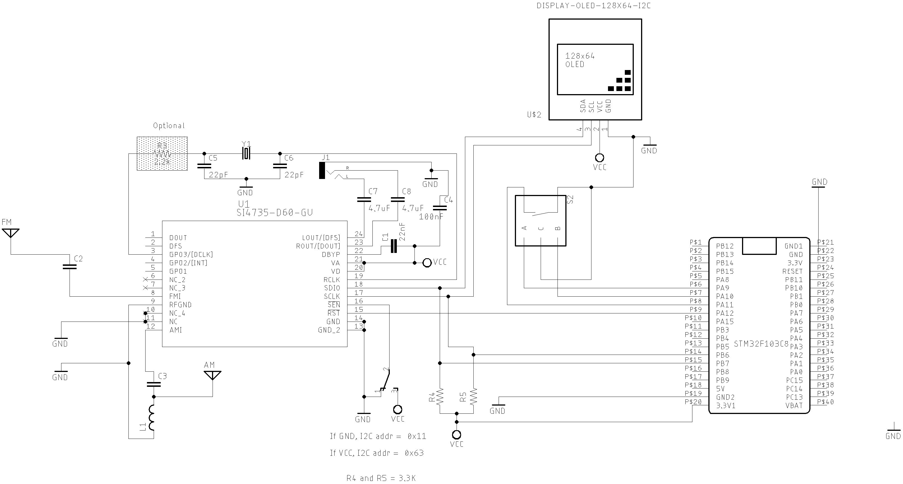

# STM32 Si4735 Arduino Library Support 

Test and validation of the SI4735 Arduino Library and SI4735 circuit.
The examples of this folder are using the STM32F103 Series. See references below to know how to setup STM32 on Arduino IDE. 

### STM32F1 and SI4735-D60 or SI4732-A10 wire up

| Si4735  | SI4732   | DESC.  | ESP32    | 
|---------| -------- |--------|----------|
| pin 15  |  pin 9   | RESET  |   PA12   |  
| pin 18  |  pin 12  | SDIO   |   B7     |
| pin 17  |  pin 11  | SCLK   |   B6     |

## Schematics

The schematics below guide you to build a SI473X based receiver using the STM32 device. 

###  Bluepill Basic schematic V1

  | Device name   | Device Pin / Description |  STM32F1|
  | --------------| -------------------------| --------|
  | OLED          |                          |         |
  |               | SDA/SDIO                 |  B7     | 
  |               | SCL/SCLK                 |  B6     | 
  | Encoder       |                          |         |
  |               | A                        |  PA9    |
  |               | B                        |  PA10   |
  |               | PUSH BUTTON (encoder)    |  PA11   |
  | Buttons       |                          |         |
  |   MODE_SWITCH | Switch MODE (Am/LSB/USB) |  PA2    |  
  |   BANDWIDTH   | Bandwidth                |  PA3    |  
  |   VOL         | Volume Up                |  PA4    |
  |   VOL_DOWN    | Volume Down              |  PA5    |
  |   BAND_UP     | Next Band                |  PA6    | 
  |   BAND_DOWN   | Previous band            |  PA7    | 
  |   AGC_SWITCH  | Switch AGC               |  PA8    | 
  |   STEP_SWITCH | Step Switch              |  PA11   | 
  |   BFO_SWITCH  | BFO or VFO switch        |  PA15   |

### Bluepill Basic schematic V2

  STM32F1 and components wire up. 
  
  | Device name   | Device Pin / Description |  STM32F1 |
  | --------------| -------------------------| --------|
  |    OLED       |                          |         |
  |               | SDA/SDIO                 |  B7     | 
  |               | SCL/SCLK                 |  B6     | 
  |    Encoder    |                          |         |
  |               | A                        |  PA9    |
  |               | B                        |  PA10   |
  |               | PUSH BUTTON (encoder)    |  PA11   |

## Examples (Sketches)

Follow the source code documentation added to each sketch     

## STM32 setup on Arduino IDE

* [Arduino core support for STM32 based boards](https://github.com/stm32duino/Arduino_Core_STM32)
* [STM32CubeProgrammer software description](https://www.st.com/resource/en/user_manual/dm00403500-stm32cubeprogrammer-software-description-stmicroelectronics.pdf)
* [Getting Started With Stm32 Using Arduino IDE](https://www.instructables.com/id/Getting-Started-With-Stm32-Using-Arduino-IDE/)
* [Getting Started with STM32 using Arduino IDE: Blinking LED](https://circuitdigest.com/microcontroller-projects/getting-started-with-stm32-development-board-stm32f103c8-using-arduino-ide)

### Board Manager 

One of the two Boards Manager URLs below can be used. 

* Option 1: https://github.com/stm32duino/BoardManagerFiles/raw/master/STM32/package_stm_index.json
* Option 2: http://dan.drown.org/stm32duino/package_STM32duino_index.json

### Arduino IDE setup 

The instruction below shows the use of the first option above.  

On __File__ menu, go to __Arduino Preferences__ and add the URL __https://github.com/stm32duino/BoardManagerFiles/raw/master/STM32/package_stm_index.json__ in __Aditional Boards Manager URLs__ text box. 

After, go to __Tools__, select Board and click on __Boards Manager...__ Then, install the board __STM32 Cores__. 

Finally, select the right STM32 board you are using. 

## Video

