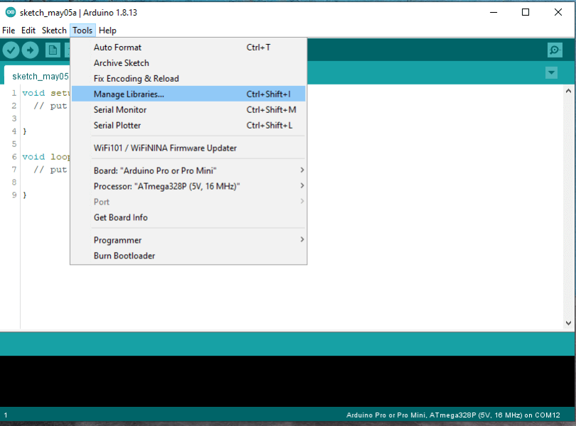
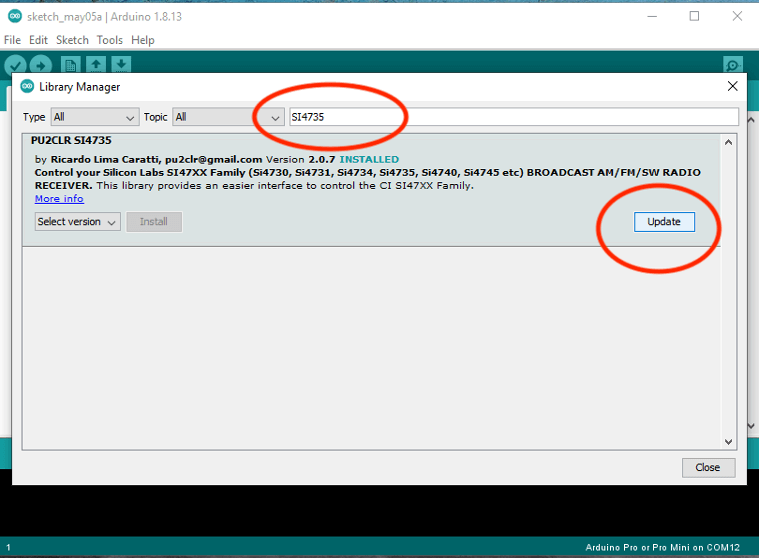

# KIT sold on Aliexpress and eBay

The kit below is sold on Aliexpress and eBay.  Although the seller does not explicitly mention that the Arduino sketch used by the KIT is based on this library (PU2CLR SI4735 Arduino Library), I’ve been testing successfully the sketch [SI473X_ALL_IN_ONE_OLED_CHINESE](https://github.com/pu2clr/SI4735/tree/master/examples/SI47XX_KITS/AliExpress/SI473X_ALL_IN_ONE_OLED_CHINESE) on some KITs acquired by some Brazilians experimenters. __The author of this library does not know the seller of this kit and does not have a commercial relationship with any commercial product that uses the library. It is important you understand that there is no guarantee that this sketch will work correctly in your current product__.

__IT IS IMPORTANT TO SAY THAT THE SSB PATCH CONTENT IS NOT PART OF THIS LIBRARY. ALSO, IT IS IMPORTANT TO SAY THAT THE AUTHOR OF THIS LIBRARY DOES NOT ENCOURAGE ANYONE TO USE THE SSB PATCHES CONTENT FOR COMMERCIAL PURPOSES. IN OTHER WORDS, THIS LIBRARY ONLY SUPPORTS SSB PATCHES, THE PATCHES THEMSELVES ARE NOT PART OF THIS LIBRARY__.

 __ATTENTION: If you do not have experience with Arduino platform, please, do not try to upload the sketches available here to your receiver. It can make your device stop working.__ 

__IN NO EVENT SHALL THE AUTHOR OF THIS LIBRARY BE LIABLE FOR ANY CLAIM, DAMAGES OR OTHER LIABILITY, WHETHER IN AN ACTION OF CONTRACT, TORT OR OTHERWISE, ARISING FROM, OUT OF OR IN CONNECTION WITH THE PRODUCT__.

__DO NOT BUY THIS RECEIVER BEFORE READING COMMENTS AND REPORTS ABOUT IT. FOLLOW THE REFERENCES BELOW:__

* [SWLing - Any thoughts on this inexpensive Si4732-based receiver?](https://swling.com/blog/2021/04/any-thoughts-on-this-inexpensive-si4732-based-receiver/)
* [Kevin O'Reilly: SI4732 The end of the line?](https://youtu.be/A3Mus-7lTrk)
* [Si47XX for Radio Experimenters](https://www.facebook.com/groups/532613604253401)
* [SI4735 SI4732 All Band Radio Receiver User Group](https://www.facebook.com/groups/340642344032449)

The photos below show the KIT sold on Aliexpress and eBay.

  

# Firmware Update via Desktop Arduino IDE

The steps below will guide you to update the firmware of the KIT

DO NOT TRY IT IF YOU DON'T KNOW WHAT ARE YOU DOING.

Be sure you are using the last version of the Arduino IDE

## Step 1

Open the Arduino IDE and go to the __Tools__ menu and select  __Manage Libraries…__

## Step 2

Look for SI4735 library and click on Update

## Sept 3 

Check the version installed 

## Step 4

Install the Libraries Tiny4kOLED and TinyOLED-Fonts libraries. Use the same approach shown before. 

[Firmware Update 04](./images/p04.png)

[Firmware Update 05](./images/p05.png)

## Step 5

Go to File Menu, Examples item  and look for the firmware

[Firmware Update 06](./images/p06.png)

## Step 6

Check the sketch you have just loaded from PU2CLR_SI4735 Examples folder

[Firmware Update 07](./images/p07.png)

## Step 7

Select the right Arduino Board.  On Tools Menu, select Arduino AVR Boards and Arduino Nano. 

[Firmware Update 08](./images/p08.png)

## Step 8 

Select the right Processor. On Tools menu, select “Processor:” 

[Firmware Update 09](./images/p09.png)

## Setup 9

Connect your Receiver (Arduino device) to your computer and select the right COM port. The COM number will depend on your computer setup.

[Firmware Update 10](./images/p10.png)

## Step 10

Finally, run the upload. 

[Firmware Update 11](./images/p11.png)

