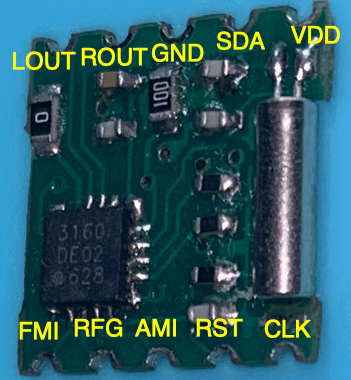
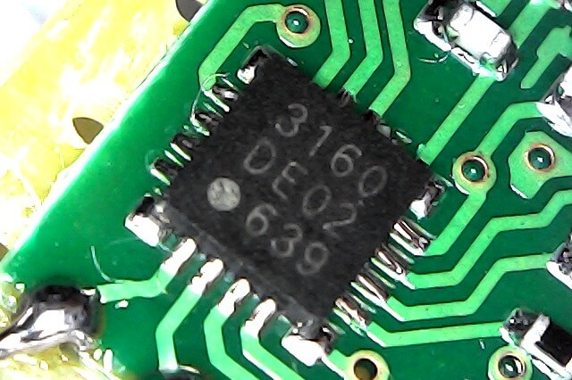

# About the board based on SI4730-D60 labeled "PL102BA-S V:2.1 10628" 

At first glance, the Si4730-D60 was manufactured to work only in FM and AM (MW) modes. There is nothing explicit in Silicon Labs manuals to suggest that this device works on LW or SW and also has FM/RDS functions. However, some hobbyists discovered this "secret" long time before "PU2CLR SI4735 Arduino Library" was released. 

If you are not interested in the SSB mode available on the SI4735-D60, the SI4730-D60/"PL102BA-S V:2.1 10628" can be an excellent alternative.

__It is important to note that there is another breakout board labeled "NE928 10A V01" also sold on eBay and AliExpress very similar to the "PL102BA-S V:2.1 10628"  which is also based on the SI4730. However, it DOES NOT WORK on LW and SW__. So, if you want LW, SW and FM/RDS features, please, check the breakout label before buying it. The breakout label is "PL102BA-S V:2.1 10628" or the CHIP ID/label is "3160 DE02 639". See photos below.  

To know more about "NE928 10A V01" (just AM/MW and FM) see [About the board NE928-10A V:01](https://pu2clr.github.io/SI4735/extras/BOARD_NE928_10A_V_01/).

The __PU2CLR SI4735 Arduino Library__ works very well with "NE928 10A V01" (just AM/MW and FM) and "PL102BA-S V:2.1 10628 (all band AM and FM + RDS/RBDS). Any Arduino sketch used for the SI4735 can be used for the SI4730-D60/"PL102BA-S V:2.1 10628". Of course, functions that deal with SSB mode will not work with this devices.

## The photos bellow show the SI4730-D60 based board labeled "PL102BA-S V:2.1 10628" 

### PL102BA-S V:2.1 10628 pinout

## PL102BA-S V:2.1 10628 label

## IC SI4730-D60 QFN  ID/Label "3160 DE02 639"

## Arduino Pro Mini 3.3V (8MHz) connection

|  board NE928-10A V:01 |  Arduino Pro Mini |
| --------------------- | ----------------- |
| GND  | GND | 
| VA   | VCC |
| SDA  | A4  |
| CLK  | A5  |
| RST  | D12 |

### Recommended sketches

Any sketch found on [Examples](https://pu2clr.github.io/SI4735/examples/). Remember: the SI4730-D60 does not have support to SSB patches.

## The Si473X I2C address 

The "PL102BA-S V:2.1 10628" comes with the SEN pin connected to +V. So, the I2C bus address is 0x63. 
Some examples in this library detect the bus address automatically. However, you should be aware of this if your assembly does not work at first.

## Video

The video below shows some tests made with SI4730-D60 and the breakout "PL102BA-S V:2.1 10628"  



[Si4730-D60 ultimate testing (FM/RDS + LW + SW)](https://youtu.be/lRYE854EOrk)

