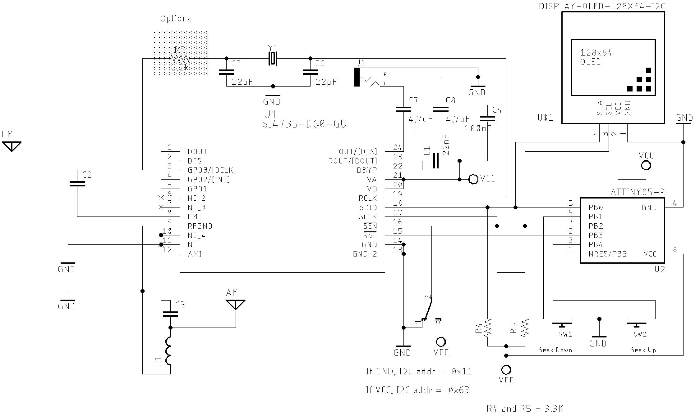

# Schematics and Sketches


Please, also check the comments at the beginning of each sketch example available in this library. You will find the SI473X, button, encoder, display and Arduino settings.  


## Basic Schematic (Atmega328 based board)

The schematic below shows how to connect the SI473X (SSOP24 package) circuit with Arduino Pro Mini 3.3V/8MHz.


[All Sketches on SI47XX_01_SERIAL_MONITOR folder](https://github.com/pu2clr/SI4735/tree/master/examples/SI47XX_01_SERIAL_MONITOR)


<BR>

## Atmega328 based board and OLED


Sketche [SI47XX_02_ALL_IN_ONE_OLED](https://github.com/pu2clr/SI4735/blob/master/examples/SI47XX_03_OLED_I2C/SI47XX_02_ALL_IN_ONE_OLED/)

<BR>

## ESP32 based board 


The schematic below guides you to build a SI473X based receiver using the ESP32 device. 


#### ESP32 basic setup


#### ESP32 DEVKIT with OLED and Encoder setup


[All Sketches on SI47XX_06_ESP32 folder](https://github.com/pu2clr/SI4735/tree/master/examples/SI47XX_01_SERIAL_MONITOR)

<BR>

## Standalone ATmega328 with or without external Crystal (SI4735-D60 and LCD 16x2). 

The schematic below can be also used with a regular Arduino Board based on ATmega328. It is almost the same circuit posted by Mirko Pavleski on his [Arduino Project repository](https://create.arduino.cc/projecthub/mircemk/diy-si4730-all-band-radio-lw-mw-sw-fm-1894d9). If you use an SI4735-D60 or SI4732-A10, you can have a All band receiver with FM, AM and SSB modes. 


Sketch [SI47XX_02_for_Mirko_Pavleski_radio](https://github.com/pu2clr/SI4735/tree/master/examples/SI47XX_02_for_Mirko_Pavleski_radio). 


Please, use the [MiniCore](https://github.com/MCUdude/MiniCore) setup on your Arduino IDE to deal with standalone Atmega328.

<BR>

## Basic schematic with TFT

The schematic below guides you to build your own receiver based on the SI473X with TFT display. The sketches available on [examples/SI47XX_04_TFT/](https://github.com/pu2clr/SI4735/tree/master/examples/SI47XX_04_TFT) folder decribe the wire up used by the TFT selected by the author. Please, read the comments at the beginning of each sketch example.  


Sketches on [examples/SI47XX_04_TFT/](https://github.com/pu2clr/SI4735/tree/master/examples/SI47XX_04_TFT)

<BR>

## Arduino DUE/MEGA and touch TFT display. 

The schematic below shows just the Arduino DUE and SI473X connections. The touch TFT used by this circuit is a shield that can be connected to the Arduino DUE directly. If you intent to use Arduino Mega, you have to add a bidirectional logic level converter. 


Sketches on [SI47XX_10_RDS](https://github.com/pu2clr/SI4735/tree/master/examples/SI47XX_10_RDS)

See videos: 

* [Arduino DUE](https://youtu.be/oI9TfJ-8Z9Q)
* [Arduino MEGA 2560](https://youtu.be/fLA2-WFK6GY)




<BR>

## Attiny85 basic circuit

You can use de Si4735 Arduino Library on the very small ATtiny85 or Attiny84. The schematic below can guide you to build a receiver based on attiny85 device. 





Sketches on [examples/SI47XX_05_ATTINY85](https://github.com/pu2clr/SI4735/tree/master/examples/SI47XX_05_ATTINY85)

See videos: 

* [SI4735 Arduino Library working with ATtiny85](https://youtu.be/oI9TfJ-8Z9Q)
* [How to "SI4735 Arduino Library and ATtiny85"](https://youtu.be/zb9TZtYVu-s)




<BR>

## Bluepill - STM32F103C8 basic schematic

The schematic below guides you to build a SI473X based receiver using the STM32 device. 


Sketches on [SI47XX_07_STM32](https://github.com/pu2clr/SI4735/tree/master/examples/SI47XX_07_STM32)


See videos: 

* [Si4735 Arduino Library and Bluepill STM32F103](https://youtu.be/https://youtu.be/v4o5_lKKATc)





<BR>

## [Android and iOS Remote Control for PU2CLR Arduino Library DSP receivers](https://github.com/pu2clr/bluetooth_remote_control)

The schematic below is a simple example that shows a way to use your smartphone as a remote control via Bluetooth. You will find more details [here](https://pu2clr.github.io/bluetooth_remote_control/).


See [Android and iOS Remote Control for PU2CLR Arduino Library DSP receivers](https://pu2clr.github.io/bluetooth_remote_control/).

<BR>

## [Android and iOS Remote Control for PU2CLR Arduino Library DSP receivers](https://github.com/pu2clr/bluetooth_remote_control)

The schematic below is a simple example that shows a way to use your smartphone as a remote control via Bluetooth. You will find more details [here](https://pu2clr.github.io/bluetooth_remote_control/).


See [Android and iOS Remote Control for PU2CLR Arduino Library DSP receivers](https://pu2clr.github.io/bluetooth_remote_control/).


<BR>

## External Mute Circuit 

The SI47XX devices have about DC bias component in the analog audio output pins (SI4735-D60 pins 23 and 24). When the device goes to power down mode, the voltage on the audio pins drops to 0V.  The device do it internally and there is not a way to avoid that. When the device goes to power up, that audio pins suddenly goes to high DC again. This transition causes the loud pop in the speaker. It is possible to solve this problem by adding an extra __mute__ circuit and control it by the MCU (Atmega, ESP32, STM32, ATtiny85 etc). 


Considering that you are using a MCU based on Atmega328, when the D14 is HIGH the Si47XX output audio will be drained to the ground. At this condition, no audio will be transferred to the amplifier input and, consequently, to the speaker. So, no loud click in the speaker. 

When the D14 is LOW, the most of signal audio output from the Si47XX will be transfered to the input of the amplifier. 

The code below shows all you have to do in your sketch to implement this resource.


```cpp

#include <SI4735.h>
#define AUDIO_MUTE 14      // Pin A0 - Switch AGC ON/OF

Si4735 r;

void setup() {
  .
  
  // It is all you have to do to control a external audio mute circuit if you have one. 
  r.setAudioMuteMcuPin(AUDIO_MUTE); // Tells the system to control an external audio mute circuit. 

  r.setup(RESET_PIN, -1, 1, SI473X_ANALOG_AUDIO); // Starts on FM mode and ANALOG audio mode. 
  .
  .
  .

} 
```

Some low power audio amplifiers IC also implement mute circuit that can be controlled externally. You can find this resource on __[LM4906](http://www.ti.com/lit/ds/symlink/lm4906.pdf), [LM4863](https://www.ti.com/lit/ds/symlink/lm4863.pdf?ts=1588602798363), KA8602B, MC34119, PAM8403__ and __HT82V739__ devices.

<BR>


## Band Pass Filter controlled by Arduino

It is a HF band pass filter controlled by Arduino. It is designed for HF receivers. With this project, you can use a set of up to four HF bandpass filters that can be selected by Arduino. To do that you will need just two digital Arduino pins. All about this project on [here](https://pu2clr.github.io/auto_bpf_arduino/).


[Back to the main page](https://pu2clr.github.io/SI4735/)


