# Schematics and Sketches

Please, also check the comments at the beginning of each sketch example available in this library. You will find the SI473X, button, encoder, display and Arduino settings.  

__IT IS IMPORTANT TO SAY THAT THE CIRCUITS DESIGN BUILT BY THE AUTHOR ARE NOT INTEND TO BE A FINAL PRODUCT. SOME IMPORTANT ASPECTS AND DETAILS ABOUT A GOOD RECEIVER WERE OMITTED HERE. THE IDEA OF THE CIRCUITS MADE BY THE AUTHOR WERE ORIENTED TO BE A PROVE OF CONCEPT OF THE FUNCTIONS IMPLEMENTED IN THE ARDUINO LIBRARY. SO, COMPONENTS LIKE RF FRONT-END, BAND PASS FILTER,  ESD, ANTENNA DESIGN ARE NOT THE MAIN PART OF THIS PROJECT__.

__This project is about a library to control the SI47XX devices and the focus of this project is the library and its functionalities. Please, don't ask the author to assist you with displays, encoders, buttons or something else out of the "PU2CLR SI4735 Arduino Library" scope. Thanks.__

### Use the following groups to guide you in your projects

* __Facebook__ group called [__Si47XX for Radio Experimenters__](https://www.facebook.com/groups/532613604253401/). The purpose is exchanging experiences with projects based on Silicon Labs  SI47XX IC family. 
* __group.io__ [SI47XX for hobbyists](https://groups.io/g/si47xx). This group is formed by people with experience in electronics and firmware development. 
  

## SI4735 and SI4732 pinout

If the schematic uses the SI4735 but you have the SI4732, all you have to do is following the lables of those devices to replace them. See pictures below. See the table __SI4735-D60 and SI4732-A10 replacement__  below. 

### The picture below shows the SI4735-D60/SI4730-D60 pinout (SSOP)

### The picture below shows the SI4732-A10 pinout (16L SOIC Package)

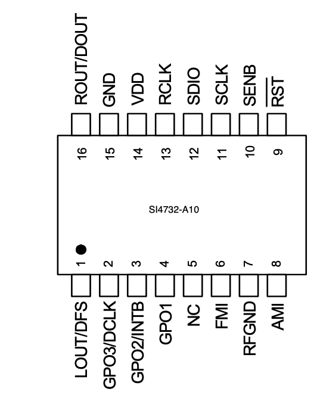

 

### SI4735-D60 and SI4732-A10 replacement 

| SI4735-D60 PIN      | SI4732-A10 PIN    | Note | 
| ------------------- | ----------------- | -----| 
| #3 (GP03/[DCLK])    | #2 (GP03/[DCLK])  |      |
| #8 (FMI)            | #6 (FMI)          |      | 
| #9 (RFGND)          | #7 (RFGND)        | Depending on your design, you can use this pin connected to GND |
| #10 and #11 (NC)    | Not applicable    | Connected to GND if you have the SI4735 | 
| #12 (AMI)           | #8 (AMI)          |      |
| #13 and #14 (GND)   | #15 (GND)         |      | 
| #15 (RST)           | #9 (RST)          |      | 
| #16 (SEN)           | #10 (SENB)        | __(*1 ) See the text ATTENTION below__ |  
| #17 (SCLK)          | #11 (SCLK)        |      |
| #18 (SDIO)          | #12 (SDIO)        |      | 
| #19 (RCLK)          | #13 (RCLK)        |      | 
| #20 and #21 (VD VA) | #14 (VDD)         | Connected to +VCC (between 2.8V and 3.7V) | 
| #22 (DBYP)          | Not applicable    |      |
| #23 (ROUT/DOUT)     | #16 (ROUT/DOUT)   |      | 
| #24 (LOUT/DFS)      | #1 (LOUT/DFS)     |      |             

(*1) __ATTENTION__: 

While the Si4735 device provides the 0x11 I²C bus address when the SEN pin is connected to the ground, the SI4732-A10 provides the same address when the SEN pin is connected to the +VCC.  The SI4735 Arduino Library provides the function __getDeviceI2CAddress__ to detect the I²C bus address automatically. This way, you don't need to worry about this setup if you use this function. See [getDeviceI2CAddress()](https://pu2clr.github.io/SI4735/extras/apidoc/html/group__group05.html#ga668008457910e916ebadf15bda2e5b29). By default, connect SEN/SENB pin to the GND. See schematics below.

 

### Basic Schematic (Atmega328 based board) 

The two schematics below show the basic setup. One using the SI4735-D60 and other using the SI4732-A10. These schematics will help you to replace the SI4735-D60 with the SI4732-A10 or vice versa. 

#### SI4735-D60 Version

The schematic below shows how to connect the SI473X (SSOP24 package) circuit with Arduino Pro Mini 3.3V/8MHz.

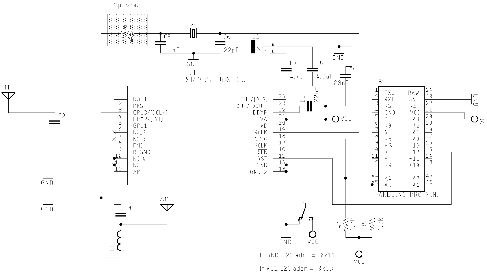

[All Sketches on SI47XX_01_SERIAL_MONITOR folder](https://github.com/pu2clr/SI4735/tree/master/examples/SI47XX_01_SERIAL_MONITOR)

|Part	| Description |
|-------| ------------ |
| C1    | 22nF Monolithic Multilayer Chip Ceramic non polarized capacitor (Place it close to VA pin)|
| C2    | 1nF Monolithic Multilayer Chip Ceramic non polarized capacitor |
| C3    | 470nF Monolithic Multilayer Chip Ceramic non polarized capacitor| 
| C4    | 100nF Monolithic Multilayer Chip Ceramic non polarized capacitor (Place it close to VD pin)|
| C5 and C6 | 22pF (Crystal load capacitors) | 
| C7 and C8 *1 | 4.7uF Monolithic Multilayer Chip Ceramic non polarized capacitor | 
| R3    | 2.2K |
| (R4 and R5) *2 | 2.2K to 10K (pull-up resistors) |
| L1 | Ferrite loop stick (about 500 μH) |
| X1    | 32.768 kHz crystal |
| SI4735 | digital CMOS AM(LW, MW and SW)/FM radio receiver IC |

#### SI4732-A10 Version

The schematic below shows how to connect the SI4732-A10  circuit with Arduino Pro Mini 3.3V/8MHz.

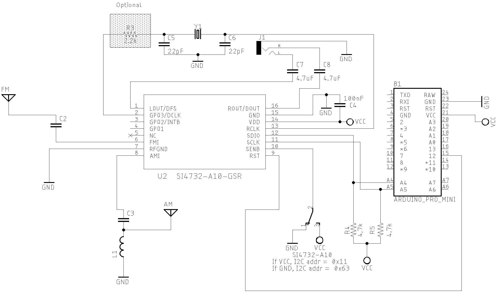

[All Sketches on SI47XX_01_SERIAL_MONITOR folder](https://github.com/pu2clr/SI4735/tree/master/examples/SI47XX_01_SERIAL_MONITOR)

 
 

## Atmega328 based board and OLED

Sketche [SI47XX_02_ALL_IN_ONE_OLED](https://github.com/pu2clr/SI4735/blob/master/examples/SI47XX_03_OLED_I2C/SI47XX_02_ALL_IN_ONE_OLED/)

 

## ESP32 based board 

The schematic below guides you to build a SI473X based receiver using the ESP32 device. 

#### ESP32 basic setup

#### ESP32 DEVKIT with OLED and Encoder setup

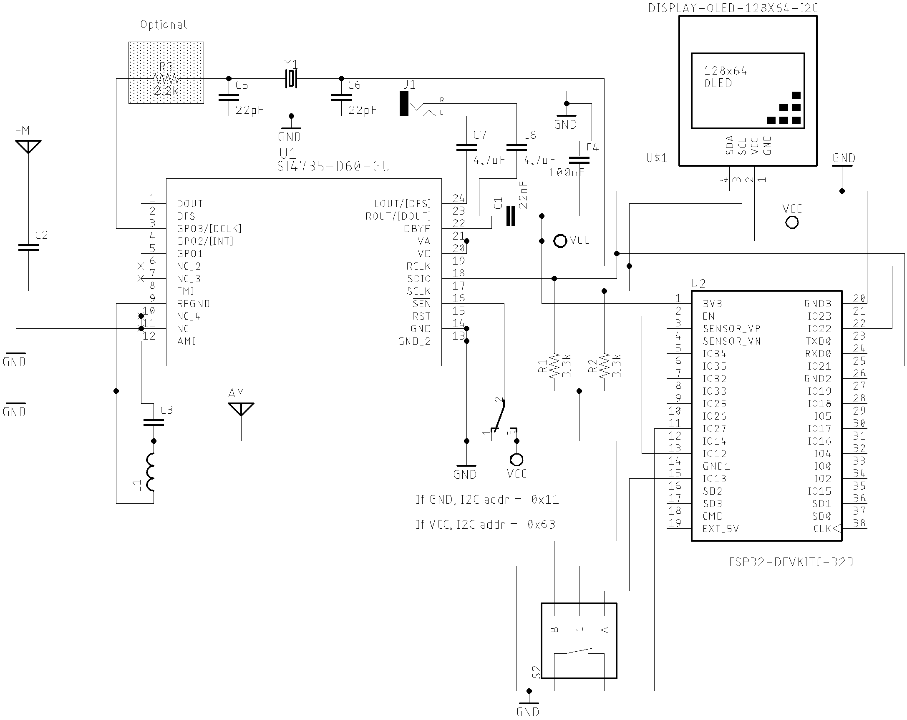

[All Sketches on SI47XX_06_ESP32 folder](https://github.com/pu2clr/SI4735/tree/master/examples/SI47XX_01_SERIAL_MONITOR)

* [Si4735 Arduino Library - Arduino Mega 2560 and ESP32 LOLIN32 WEMOS](https://youtu.be/HrxR-bUqbjw)



## ESP8266 

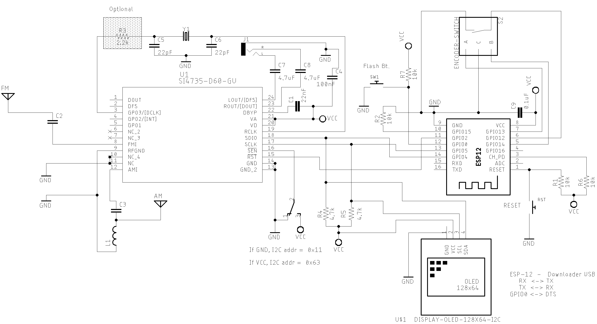

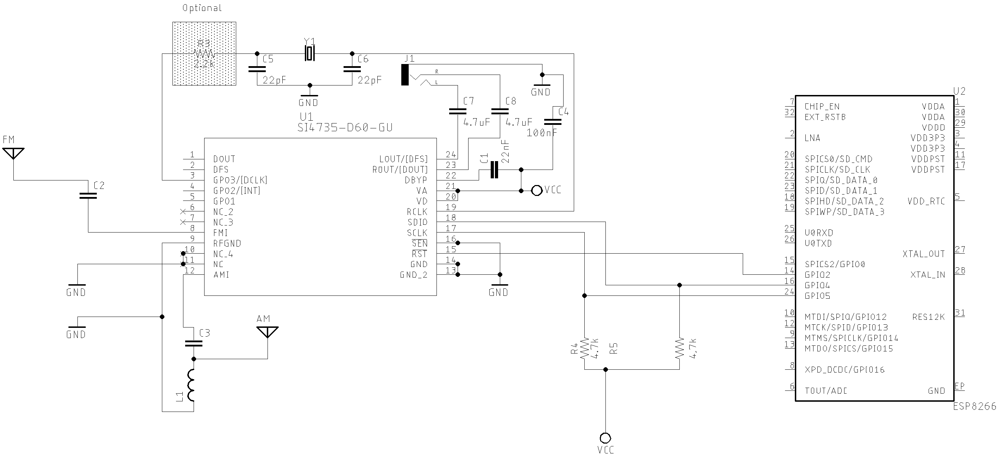

## ESP8266 OLED

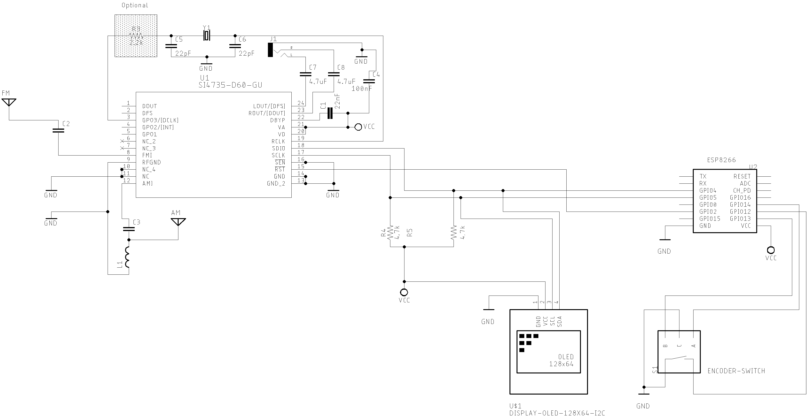

 

## Standalone ATmega328 with or without external Crystal (SI4735-D60 and LCD 16x2). 

The schematic below can be also used with a regular Arduino Board based on ATmega328. It is almost the same circuit posted by Mirko Pavleski on his [Arduino Project repository](https://create.arduino.cc/projecthub/mircemk/diy-si4730-all-band-radio-lw-mw-sw-fm-1894d9). If you use an SI4735-D60 or SI4732-A10, you can have a All band receiver with FM, AM and SSB modes. 

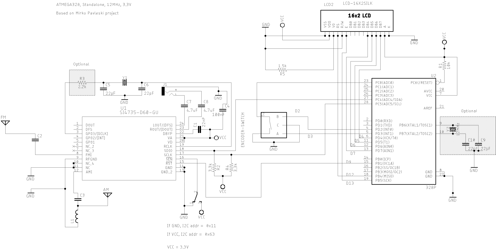

Sketch [SI47XX_02_for_Mirko_Pavleski_radio](https://github.com/pu2clr/SI4735/tree/master/examples/SI47XX_02_for_Mirko_Pavleski_radio). 

Please, use the [MiniCore](https://github.com/MCUdude/MiniCore) setup on your Arduino IDE to deal with standalone Atmega328.

See  video:

* [All band receiver based on SI473X and standalone ATmega328 Modes: FM (VHF) and AM and SSB (HF)](https://youtu.be/H-uIJclH9l8)



 

## Basic schematic with TFT

The schematic below guides you to build your own receiver based on the SI473X with TFT display. The sketches available on [examples/SI47XX_04_TFT/](https://github.com/pu2clr/SI4735/tree/master/examples/SI47XX_04_TFT) folder decribe the wire up used by the TFT selected by the author. Please, read the comments at the beginning of each sketch example.  

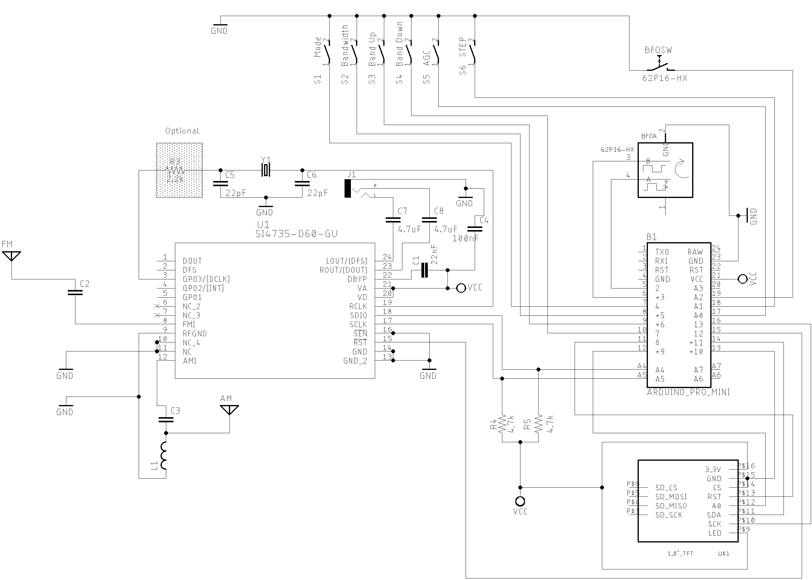

Sketches on [examples/SI47XX_04_TFT/](https://github.com/pu2clr/SI4735/tree/master/examples/SI47XX_04_TFT)

See video:
[Si4735 All in One Receiver running on Arduino Pro Mini 3.3V (8MHz) and TFT Display](https://youtu.be/oL8qyRglZ8I)



 

## Arduino DUE/MEGA and touch TFT display. 

The schematic below shows just the Arduino DUE and SI473X connections. The touch TFT used by this circuit is a shield that can be connected to the Arduino DUE directly. If you intent to use Arduino Mega, you have to add a bidirectional logic level converter. 

Sketches on [SI47XX_10_RDS](https://github.com/pu2clr/SI4735/tree/master/examples/SI47XX_10_RDS)

See videos: 

* [Arduino DUE](https://youtu.be/oI9TfJ-8Z9Q)
* [Arduino MEGA 2560](https://youtu.be/fLA2-WFK6GY)



 

## Attiny85 basic circuit

You can use de Si4735 Arduino Library on the very small ATtiny85 or Attiny84. The schematic below can guide you to build a receiver based on attiny85 device. 

### Attiny85 with external eeprom

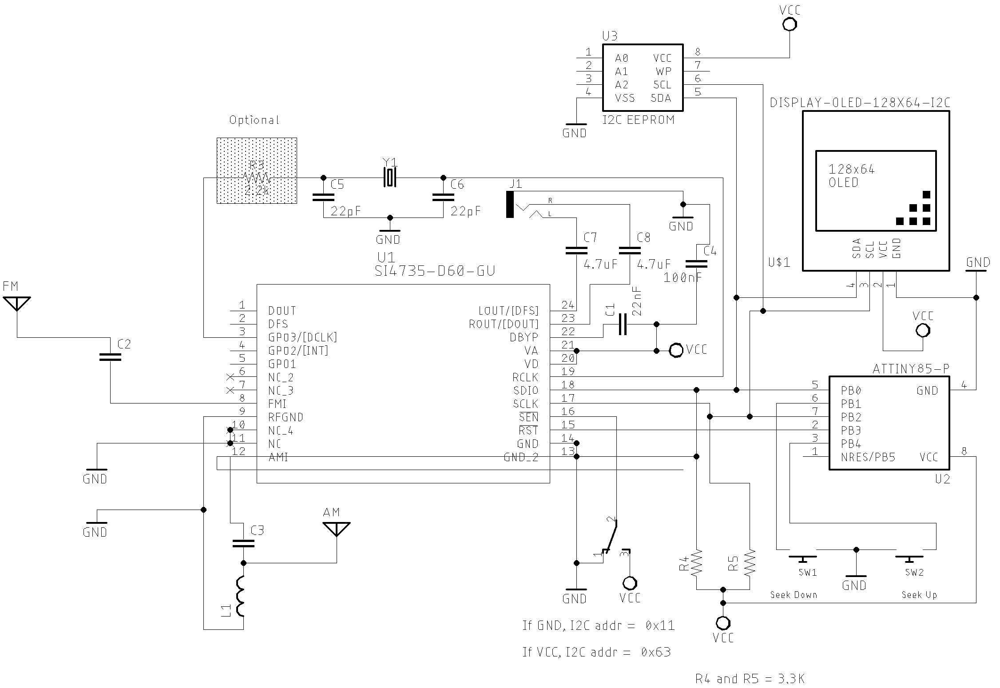

Sketches on [examples/SI47XX_05_ATTINY85](https://github.com/pu2clr/SI4735/tree/master/examples/SI47XX_05_ATTINY85)

See videos: 

* [SI4735 Arduino Library working with ATtiny85](https://youtu.be/oI9TfJ-8Z9Q)
* [How to "SI4735 Arduino Library and ATtiny85"](https://youtu.be/zb9TZtYVu-s)



 

## Bluepill - STM32F103C8 basic schematic

### STM32F1 and SI4735-D60 or SI4732-A10 wire up

| Si4735  | SI4732   | DESC.  | ESP32    | 
|---------| -------- |--------|----------|
| pin 15  |  pin 9   | RESET  |   PA12   |  
| pin 18  |  pin 12  | SDIO   |   B7     |
| pin 17  |  pin 11  | SCLK   |   B6     |

The schematic below guides you to build a SI473X based receiver using the STM32 device. 

The schematics below guide you to build a SI473X based receiver using the STM32 device. 

###  Bluepill Basic schematic V1

This version uses a Encoder with Push Button,  and 7 push button.

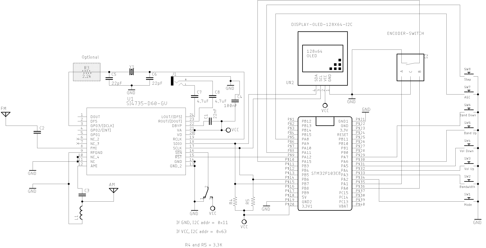

#### OLED, Encoder and Buttons connections

| Device name   | Device Pin / Description |  STM32F1|
| --------------| -------------------------| --------|
| OLED          |                          |         |
|               | SDA/SDIO                 |  B7     | 
|               | SCL/SCLK                 |  B6     | 
| Encoder       |                          |         |
|               | A                        |  PA0    |
|               | B                        |  PA1    |
|               | PUSH BUTTON (BFO/VFO)    |  PA15   | BFO_SWITCH
| Buttons       |                          |         |
|   MODE_SWITCH | Switch MODE (Am/LSB/USB) |  PA2    |  
|   BANDWIDTH   | Bandwidth                |  PA3    |  
|   VOL         | Volume Up                |  PA4    |
|   VOL_DOWN    | Volume Down              |  PA5    |
|   BAND_UP     | Next Band                |  PA6    | 
|   BAND_DOWN   | Previous band            |  PA7    | 
|   AGC_SWITCH  | Switch AGC               |  PA8    | 
|   STEP_SWITCH | Step Switch              |  PA11   | 

### Bluepill Basic schematic V2

This version uses only a Encoder with Push Button

#### OLED and Encoder connections

  
STM32F1 and components wire up. 
  
| Device name   | Device Pin / Description |  STM32F1 |
| --------------| -------------------------| --------|
|    OLED       |                          |         |
|               | SDA/SDIO                 |  B7     | 
|               | SCL/SCLK                 |  B6     | 
|    Encoder    |                          |         |
|               | A                        |  PA9    |
|               | B                        |  PA10   |
|               | PUSH BUTTON (encoder)    |  PA11   |

Sketches on [SI47XX_07_STM32](https://github.com/pu2clr/SI4735/tree/master/examples/SI47XX_07_STM32)

See video: 

* [Si4735 Arduino Library and Bluepill STM32F103](https://youtu.be/v4o5_lKKATc)



 

## Teensy 3.X and 4.X

The setup bellow works on Teensy 3.X and Teensy 4.X board family. 

### Teensy and components wire up. 

#### OLED and Encoder
  
| Device name   | Device Pin / Description |  Teensy |
| --------------| -------------------------| --------|
|    OLED       |                          |         |
|               | SDA/SDIO                 |  A4     | 
|               | SCL/SCLK                 |  A5     | 
|    Encoder    |                          |         |
|               | A                        |   9     |
|               | B                        |  10     |
|               | PUSH BUTTON (encoder)    |  11     |

#### SI4735-D60 or SI4732-A10 wire up

| Si4735  | SI4732   | DESC.  | Teensy   | 
|---------| -------- |--------|----------|
| pin 15  |  pin 9   | RESET  |   12     |  
| pin 18  |  pin 12  | SDIO   |   A4     |
| pin 17  |  pin 11  | SCLK   |   A5     |

#### Teensy Basic schematic with OLED and Encoder

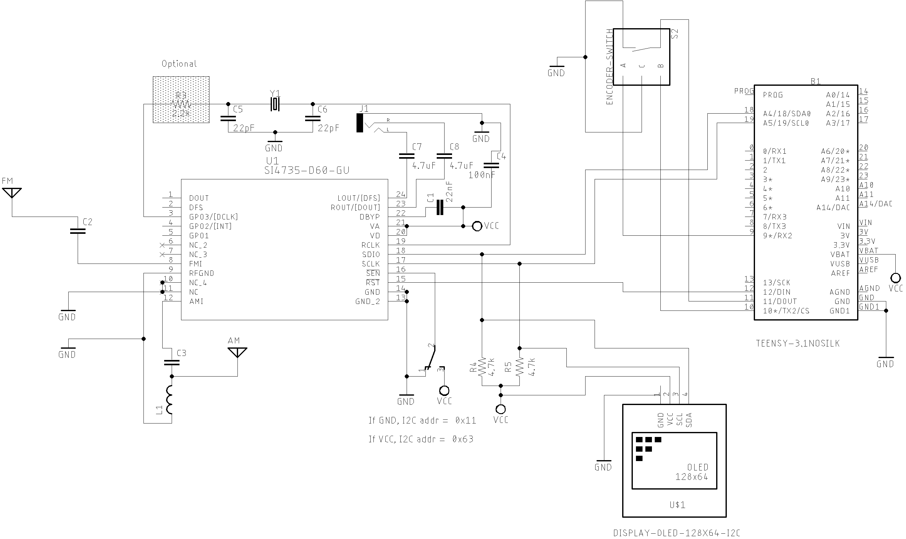

Sketches on [SI47XX_14_TEENSY](https://github.com/pu2clr/SI4735/tree/master/examples/SI47XX_14_TEENSY)

## Arduino Pro Mini 3.3V and 7SEG Display based on TM1638 

It is a receiver prototype based on SI4735 controlled by TM1638 based devices with buttons, LEDs and 7 segment display. 
This receiver covers AM and SSB (LW, MW and SW) and FM from 64 to 108 MHz.  

The photo below shows the TM1638 based device.

### SI4735, Arduino Pro Mini 3.3V, encoder and TM1638

Sketches on [SI47XX_08_TM1638](https://github.com/pu2clr/SI4735/tree/master/examples/SI47XX_08_TM1638)

See video: 

* [FM, AM and SSB receiver with Arduino and TM1638 7 segments display device](https://youtu.be/VqXkffHu6D8)

{% include schematic_basic_tm1638.html}

